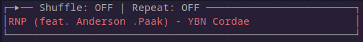

# GOtify UI 
GOtifyUI is a CLI Spotify UI built completely in Go! The app uses the Spotify Web API to interact 
with your spotify session. 

#### Dependencies
- GoCUI  - `github.com/jroimartin/gocui`
- errors -  `github.com/pkg/errors v0.9.1`
- Spotify GO Wrapper - `github.com/zmb3/spotify v0.0.0-20200112163645-71a4c67d18db`

#### Run
- Create a Spotify developer app at https://developer.spotify.com/
  - Set your Redirect URL to http://localhost:8888/callback
- Source your Spotify `client_id` and `client_secret` into the environment:
   - `SPOTIFY_CLIENT_ID` and `SPOTIFY_CLIENT_SECRET`
  
`> go run main.go` 

You will be prompted to follow a URL. This is to get the auth token from Spotify.
 Ctrl+C to exit.

#### Current Functionality:
##### Auth with Spotify
   - Read `client_id` and `client_secret` from OS environment in variables: `SPOTIFY_CLIENT_ID` and `SPOTIFY_CLIENT_SECRET` 
#####Now Playing:
   - Shows the current playing song and artist
   - Pause with space
   - Play next with right arrow
   - Play previous with left arrow
   - Auto refresh of Now Playing

   
#### Planned Functionality:
##### Playlist
 - Section for Top Tracks playlist from spotify
 - Navigation and selection of track
##### Now Playing time left info
 - Bar in the Now Playing pane that displays the time left for the song
##### Song search
 - Ability to search for a song to play
##### Volume Control
##### Configuration
 - Color configuration file to configure various colors
 - File to read client_id and client_secret from instead of environment
 - Session tracking to not have to auth with Spotify every time
 - Configurable binds
   